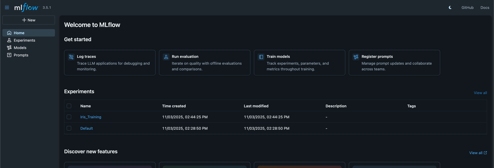
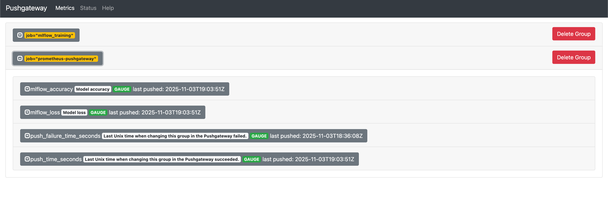
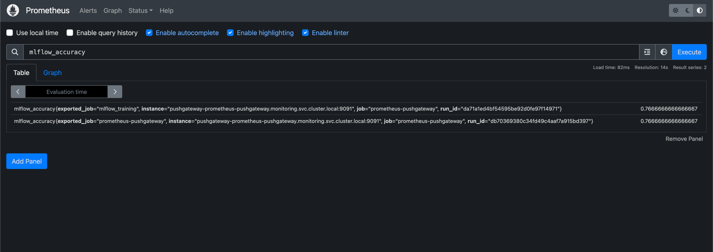
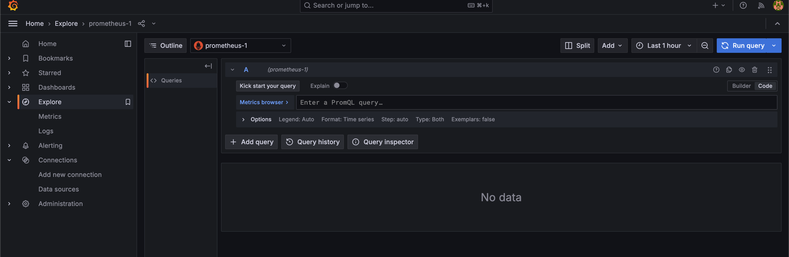
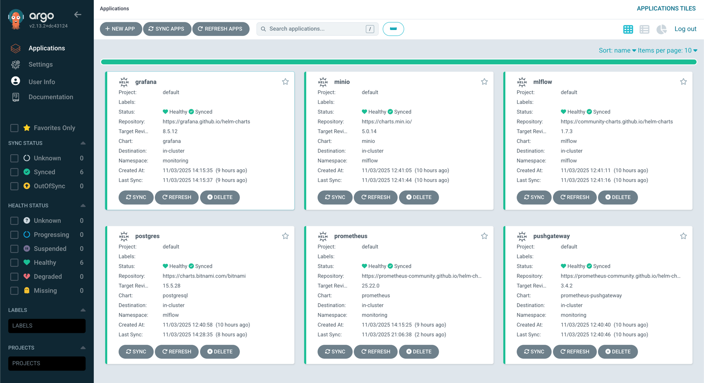
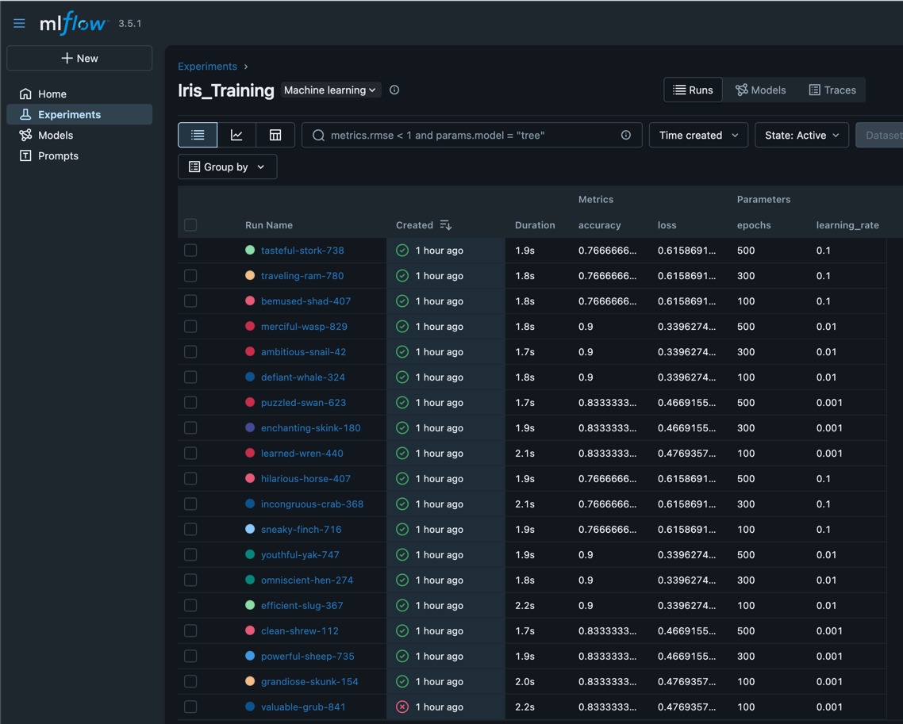
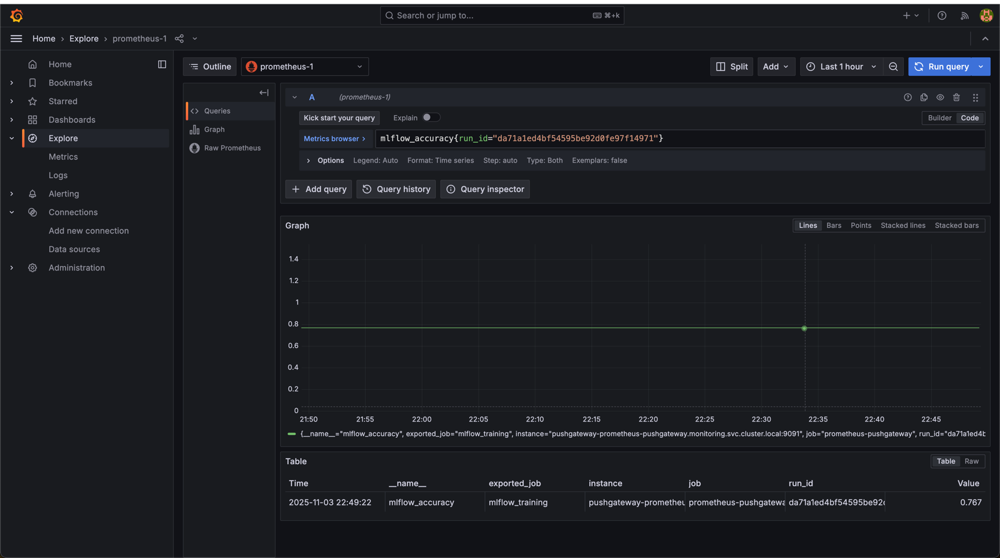

# README.md

## Port-forward для доступу до UI

### MLflow UI

```bash
kubectl port-forward svc/mlflow -n mlflow 5000:80
```

Відкрити у браузері:
[http://localhost:5000](http://localhost:5000)

### MinIO Console

```bash
kubectl port-forward svc/minio-console -n mlflow 9001:9001
```

Відкрити у браузері:
[http://localhost:9001](http://localhost:9001)

### Prometheus PushGateway

```bash
kubectl port-forward svc/pushgateway-prometheus-pushgateway -n monitoring 9091:9091
```

Відкрити у браузері:
[http://localhost:9091](http://localhost:9091)

### Prometheus Server

```bash
kubectl port-forward svc/prometheus-server -n monitoring 9090:80
```

Відкрити у браузері:
[http://localhost:9090](http://localhost:9090)

### Grafana

```bash
kubectl port-forward svc/grafana -n monitoring 3000:80
```

Відкрити у браузері:
[http://localhost:3000](http://localhost:3000)

---

## Запуск скрипта `train_and_push.py`

1. Переконайтеся, що MLflow, MinIO, PostgreSQL та Prometheus PushGateway розгорнуті у кластері Kubernetes через ArgoCD.
2. Встановіть необхідні змінні середовища:

   ```bash
   export MLFLOW_TRACKING_URI=http://localhost:5000
   export MLFLOW_S3_ENDPOINT_URL=http://localhost:9000
   export AWS_ACCESS_KEY_ID=admin
   export AWS_SECRET_ACCESS_KEY=minio123
   export PUSHGATEWAY_URL=http://localhost:9091
   ```
3. Запустіть скрипт:

   ```bash
   python mlflow-experiments/train_and_push.py
   ```
4. Скрипт завантажує датасет **Iris**, тренує кілька моделей із різними параметрами, логує метрики в **MLflow**, зберігає артефакти в **MinIO**, та пушить фінальні метрики (`accuracy`, `loss`) у **Prometheus PushGateway**.

---

## Перевірка наявності сервісів у кластері

Перевірте, що всі необхідні поди запущені:

```bash
kubectl get pods -n mlflow
kubectl get pods -n monitoring
```

Очікувані сервіси:

* `mlflow` — MLflow Tracking Server

* `minio` — зберігання артефактів
* `postgres-postgresql` — база даних для MLflow
* `pushgateway-prometheus-pushgateway` — PushGateway

* `prometheus-server` — Prometheus Server

* `grafana` — Grafana UI



---

## Перегляд метрик у Grafana

1. Увійдіть у Grafana: [http://localhost:3000](http://localhost:3000)
2. Додайте джерело даних **Prometheus**:

   * URL: `http://prometheus-server.monitoring.svc.cluster.local`
   * Натисніть **Save & Test**.
3. Перейдіть у **Explore → Prometheus**.
4. Введіть запити:

   ```promql
   mlflow_accuracy
   mlflow_loss
   ```
5. Ви побачите метрики, передані скриптом `train_and_push.py` через PushGateway.

---

## Скриншоти

* **MLflow UI** – [Посилання або вставлене зображення]

* **Grafana Explore (mlflow_accuracy, mlflow_loss)** – [Посилання або вставлене зображення]

* 
---
