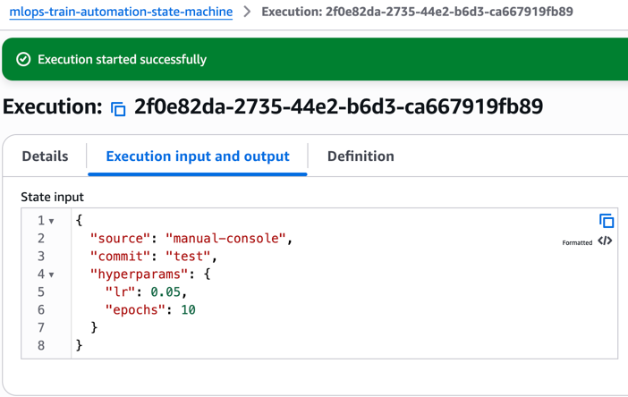
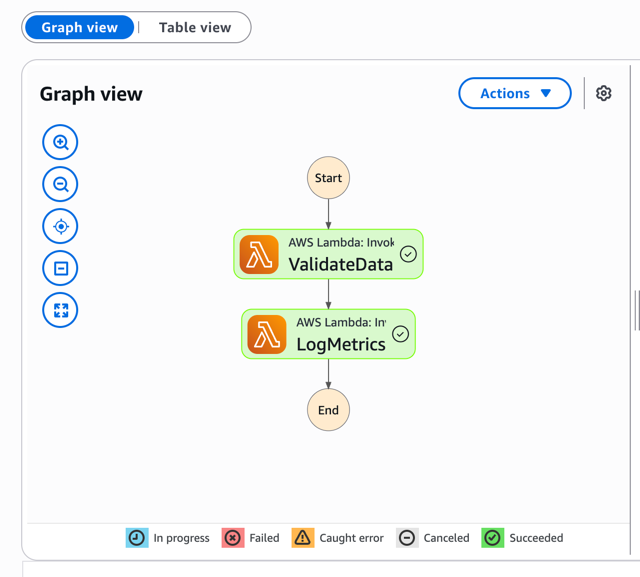
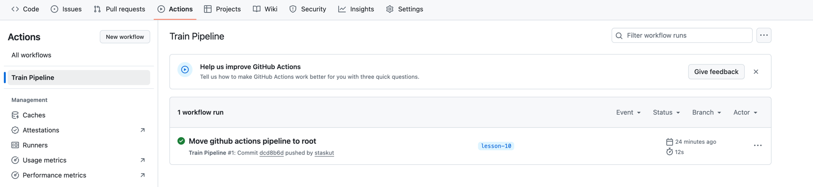
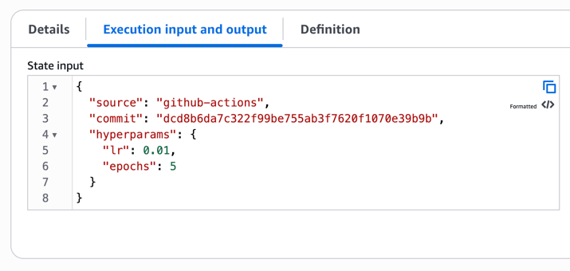

# Автоматизація тренування моделі через AWS Step Functions

---

## 1. Збір архівів .zip

Lambda-функції знаходяться в папці `terraform/lambda/`:

```
terraform/lambda/
├── validate.py
├── log_metrics.py
```

Створіть архіви з цих скриптів:

```bash
cd terraform/lambda
zip validate.zip validate.py
zip log_metrics.zip log_metrics.py
```

У результаті появляться два архіви, які використовуються при деплої через Terraform.

---

## 2. Розгортання Terraform інфраструктури

Перейдіть до папки `terraform/` та виконайте:

```bash
cd terraform
terraform init
terraform apply
```

Terraform зробить:

* створить IAM-ролі для Lambda та Step Function;
* створить дві Lambda-функції: `validate` та `log_metrics`;
* створить Step Function, яка викликає ці ламбди послідовно.

Після виконання запишіть ARN Step Function:

```bash
terraform output state_machine_arn
```

---

## 3. Перевірка Step Function через AWS Console

Відкрийте [AWS Step Functions Console](https://console.aws.amazon.com/states/home)

1. Знайдіть вашу створену машину станів (State Machine) з іменем `mlops-train-automation-state-machine`.
2. Натисніть **Start execution**.
3. Введіть JSON:

```json
{
  "source": "manual-console",
  "commit": "test",
  "hyperparams": {
    "lr": 0.05,
    "epochs": 10
  }
}

```

4. Після запуску ви бачитимете два кроки в графі виконання: **Validate** та **LogMetrics**.

---

## 4. Праця GitHub Actions job (аналог GitLab CI)

Файл workflow: `.github/workflows/train.yml`

```yaml
name: Train Pipeline

on:
  push:
    branches: [ lesson-10 ]

jobs:
  train-model:
    runs-on: ubuntu-latest
    env:
      AWS_REGION: eu-west-2
    steps:
      - name: Checkout
        uses: actions/checkout@v4

      - name: Configure AWS credentials
        uses: aws-actions/configure-aws-credentials@v4
        with:
          aws-access-key-id: ${{ secrets.AWS_ACCESS_KEY_ID }}
          aws-secret-access-key: ${{ secrets.AWS_SECRET_ACCESS_KEY }}
          aws-region: eu-west-2

      - name: Start Step Function
        run: |
          aws stepfunctions start-execution \
            --region $AWS_REGION \
            --state-machine-arn ${{ secrets.STATE_MACHINE_ARN }} \
            --name "train-$(date +%s)" \
            --input '{"source":"github-actions","commit":"${{ github.sha }}","hyperparams":{"lr":0.01,"epochs":5}}'
```

**GitHub Secrets:**

Ці секрети потрібно додати до налаштувань репозиторію:

* `AWS_ACCESS_KEY_ID`
* `AWS_SECRET_ACCESS_KEY`
* `STATE_MACHINE_ARN`

Після кожного push до гілки `lesson-10` workflow запускає Step Function в AWS.

Результат можна переглянути в GitHub вкладці **Actions** та в AWS Console у Step Functions.


---

## 5. Приклад JSON, що передається через CI

```json
{
  "source": "github-actions",
  "commit": "a1b2c3d",
  "hyperparams": {
    "lr": 0.01,
    "epochs": 5
  }
}
```

**Пояснення:**

* `source` — джерело запуску (GitHub Actions / Console / CLI)
* `commit` — хеш коміту, що ініціював пайплайн
* `hyperparams` — параметри тренування (гіперпараметри моделі)

---

## Підсумок

* Lambda-функції зібрані у `.zip`
* Terraform створює повну інфраструктуру (IAM, Lambda, Step Function)
* Step Function запускається вручну або через CI/CD (GitHub Actions)
* Вхідні параметри передаються у форматі JSON.
