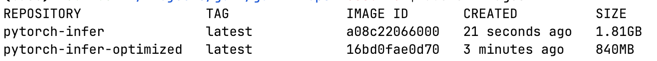

# Порівняння Docker-образів для ML-сервісу

## Розмір образів

| Образ                            | Базовий образ    | Розмір      |
| -------------------------------- | ---------------- | ----------- |
| **Fat (python:3.11)**            | python:3.11      | **1.81 GB** |
| **Optimized (python:3.13-slim)** | python:3.13-slim | **840 MB**  |

Оптимізований образ майже **вдвічі менший**, завдяки легшій базі (`slim`) і multi-stage build.

---

## Кількість шарів

| Образ         | Кількість шарів |
| ------------- | --------------- |
| **Fat**       | 21              |
| **Optimized** | 16              |

Оптимізований варіант має **на 5 шарів менше**, оскільки:

* Використано multi-stage build
* Менше інструкцій `RUN` та `COPY`

---

## Присутність зайвих інструментів

| Образ         | Зайві елементи                                                                                                      |
| ------------- | ------------------------------------------------------------------------------------------------------------------- |
| **Fat**       | Повна версія Python з додатковими бібліотеками, системні пакети `apt`, кеш `pip`, тимчасові файли установки         |
| **Optimized** | Лише необхідні системні бібліотеки (`libglib2.0-0`, `libsm6`, `libxrender1`, `libxext6`) і залежності для inference |

Оптимізований образ не містить компіляторів, кешів або зайвих dev-пакетів.

---

## Пропозиції з подальшої оптимізації

1. **CPU-only Torch** - якщо не використовується GPU

   * Встановити `torch==2.3.0+cpu` і `torchvision==0.18.0+cpu` з [PyTorch CPU wheels](https://download.pytorch.org/whl/cpu) → зменшення до ~400–500 MB.

2. **ONNX Runtime**

   * Експортувати модель у формат ONNX і використовувати `onnxruntime` замість `torch` → економія до 70% простору.

3. **Quantization / Pruning**

   * Зменшити розмір `.pt` файлу в 2–4 рази без суттєвої втрати точності.

4. **Оптимізація шарів Docker**

   * Об'єднати кілька `RUN` інструкцій у одну.
   * Використовувати `.dockerignore`, щоб не копіювати зайві файли (логи, кеші, локальні дані).

5. **Використати `python:3.13-alpine` або `debian:bookworm-slim`**

   * Ще легші базові образи (але потребують сумісності з PyTorch wheels).

---

## Висновок

* **Fat-образ (1.81 GB, 21 шар)** — підходить для тестів, але важкий і повільний при доставці.
* **Optimized-образ (840 MB, 16 шарів)** — у 2х легший, містить лише необхідне для inference.
* Подальше зменшення можливе шляхом переходу на CPU-only Torch або ONNX Runtime.
